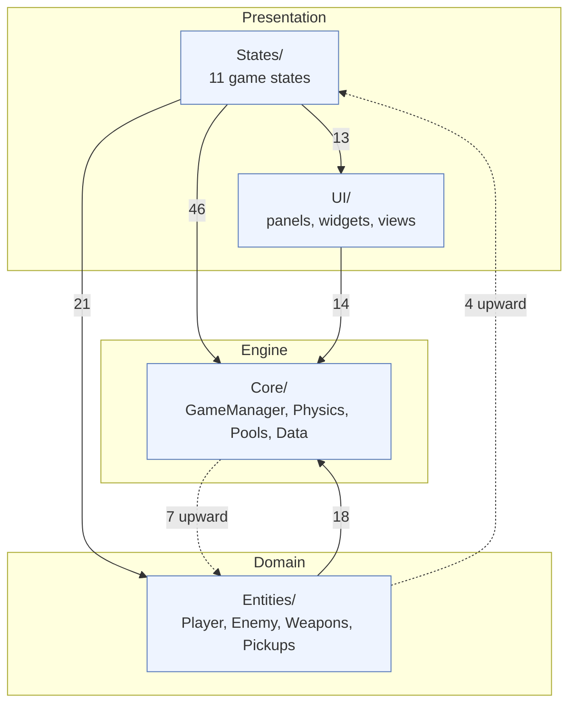
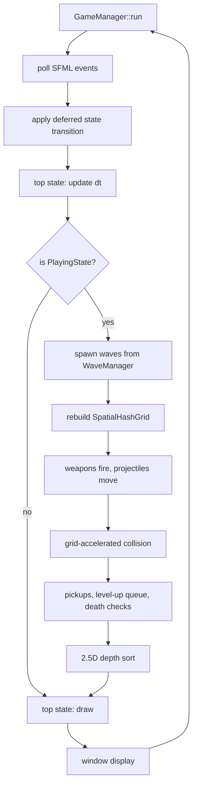
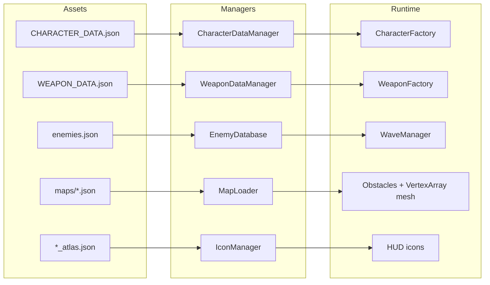
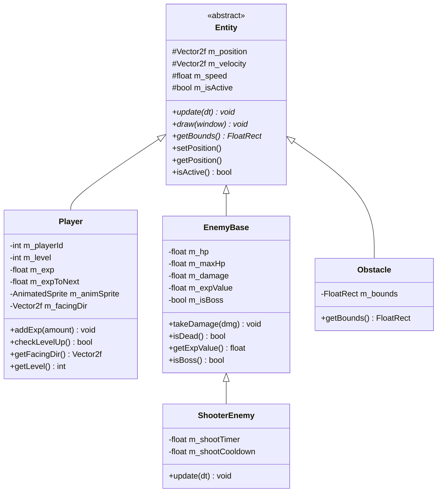
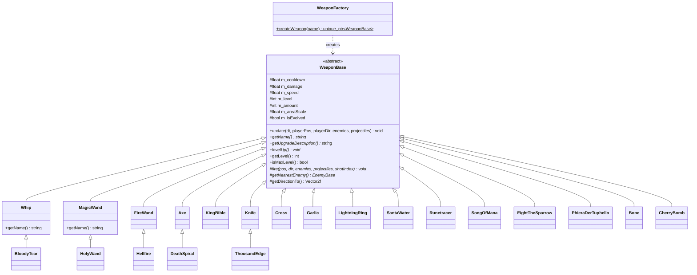
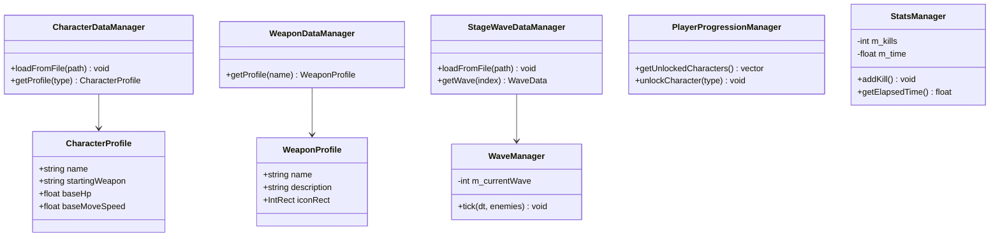
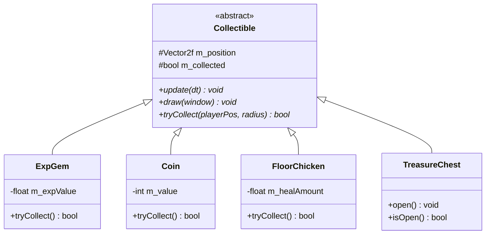

# CS202 – Vampire Survivors Clone: Project Report

**Course:** CS202 – Object-Oriented Programming  
**Language:** C++20  
**Library:** SFML 2.6  
**Build system:** CMake (FetchContent – no manual dependency installation needed)

---

> [!CAUTION]
> ## ✏️ TODO — Fill these in before submission
>
> The items below are **not done yet** and require manual updates:
>
> | # | What | Where in this file |
> |---|---|---|
> | 1 | **Demo video links** — paste YouTube / Drive URLs for all features & all levels | [Section 8](#8-demo-videos) |
> | 2 | **AI Usage Declaration** — write the required markdown + export as PDF | [Section 9](#9-ai-usage-declaration) |
> | 3 | **Member contribution table** — fill in each member's work percentage | [Section 7](#7-member-contribution) |
> | 4 | **Export to PDF** — run `pandoc report.md -o report.pdf` (or paste into Word/Google Docs) | — |
> | 5 | **Feature list audit** — remove / replace any features that are not actually playable in the demo | [Section 5](#5-feature-list-40-features--025-pts--10-pts) |


---

## 1. Project Overview

This is a faithful clone of the roguelite bullet-heaven game *Vampire Survivors*, built from scratch in C++20 with SFML. The player controls a character that auto-attacks enemies every frame, collects EXP, levels up, picks new weapons or upgrades, and tries to survive 30 minutes or defeat the stage boss.

---

## 2. High-Level Architecture

### 2.1 Package structure

The project is layered into four top-level source packages (159 source files total):

| Package | Files | Responsibility |
|---|---|---|
| `Core/` | 42 | Engine primitives: `GameManager` (FSM host), `ObjectPool`, `Observer`/`Subject`, `Physics`, `SpatialHashGrid`, `ResourceManager`, data managers |
| `Entities/` | 48 | Runtime objects: `Entity` -> `Player` / `EnemyBase` / `Obstacle`, plus `Projectile`, `Weapons` and `Pickups` |
| `States/` | 27 | FSM nodes: MainMenu, CharacterSelect, StageSelect, Shop, StageLoading, Playing, LevelUp, Pause, TreasureChest, GameOver, Summary |
| `UI/` | 42 | Reusable UI components, panels and views shared across states |

### 2.2 Layer dependencies

Edge labels are the number of `#include` relationships between packages, counted from
the source rather than idealised:



The dependency flow is predominantly downward: presentation depends on domain, domain
depends on engine. **Dotted edges are upward dependencies that break strict layering**,
and we record them rather than hide them:

- `Core/Physics` and `Core/Data` include concrete entity types (`EnemyBase`, `Obstacle`,
  `EnemyDatabase`) because collision, knockback and map loading operate on those types
  directly instead of on an abstract interface.
- `Entities/Pickups` (`Coin`, `ExpGem`, `FloorChicken`) include `PlayingState`, because a
  pickup calls back into the running game to grant gold, EXP or health.
- `Core/GameManager` includes `PlayingState` and `MainMenuState` to construct the initial
  state.

The cleanest fix would be to invert these through interfaces -- a `PickupReceiver` that
`PlayingState` implements would remove the `Entities -> States` edge entirely. We left it
as-is because the coupling is small and stable, but it is a genuine deviation from the
layering the diagram otherwise follows.

### 2.3 Frame flow

One iteration of the main loop. `GameManager` owns a stack of states and delegates to the
top of it; only `PlayingState` runs the full simulation:



### 2.4 Data-driven pipeline

Content is authored as JSON and loaded at run time, so adding a stage, character or
enemy needs no code change:



---

## 3. Class Diagrams

### 3.1 Entity Hierarchy



### 3.2 Weapon System



### 3.3 State Machine (Game Flow)


### 3.4 Core Systems


### 3.5 Data Layer



### 3.6 Pickup / Collectible System



---

## 4. Applied Design Patterns

### 4.1 Finite State Machine (FSM) — *Behavioral Pattern*

**Where:** `GameManager` + all `GameState` subclasses.

`GameManager` owns a `std::stack<unique_ptr<GameState>>`. States are swapped via deferred transitions (`m_pendingState`, `m_shouldChange` flags) evaluated at the start of each frame loop — preventing a state from deleting itself mid-`update()` and causing use-after-free.

**Reasoning:** The game has 11 distinct modes. Hardcoding transitions in a monolithic loop would be unmaintainable. The stack model lets modal overlays (Pause, LevelUp) sit on top of PlayingState without destroying it.

---

### 4.2 Template Method — *Behavioral Pattern*

**Where:** `WeaponBase::update()` (non-virtual) calls `fire()` (pure virtual).

`WeaponBase::update()` owns the cooldown timer and burst-fire scheduling logic, then calls the abstract `fire()` at the right moments. Each concrete weapon only overrides `fire()`.

**Reasoning:** All 16+ weapons share identical cooldown, burst-interval, and `setSourceWeapon` bookkeeping. Without Template Method this would be copy-pasted in every weapon class. Any future timing tweak is fixed in one place.

---

### 4.3 Factory Method — *Creational Pattern*

**Where:**
- `WeaponFactory::createWeapon(const std::string& name)`: Instantiates concrete weapons from string identifiers.
- `CharacterFactory::configurePlayer(Player& player, CharacterType type, std::vector<std::string>& outStartingWeapons)`: Encapsulates sprite setup, animation frame slicing from atlas JSONs, and starting weapon assignment for all 40+ characters.

**Reasoning:**
- Decouples the 16+ concrete weapon types and 40+ playable character variants from game states.
- Avoids monolithic `switch` blocks in `PlayingState` and isolates sprite asset paths, atlas parsing, and initial weapon distributions into clean, dedicated factory classes.

---

### 4.4 Observer / Subject — *Behavioral Pattern*

**Where:** `Core/Observer.h` — `Observer` (abstract), `Subject` (mixin), `GameEvent` enum.

Game objects that produce notable events inherit `Subject` and call `notify(GameEvent)`. Interested systems register as `Observer*` and react in `onNotify()`.

**Reasoning:** Eliminates tight coupling between, e.g., an enemy dying and the UI gold counter updating. The enemy doesn't need a pointer to UIManager.

---

### 4.5 Object Pool — *Creational / Performance Pattern*

**Where:** `ObjectPool<T>` template; used as `ObjectPool<EnemyBase>` and `ObjectPool<ShooterEnemy>` in `PlayingState`.

Pre-allocates 10 000 enemy objects and 2 000 shooter objects at startup; `acquire()` pops from the free list in O(1), `release()` pushes back. Raising the capacity was a one-line constructor change precisely because allocation is encapsulated behind the pool.

**Reasoning:** A Vampire Survivors clone spawns hundreds of enemies per minute. Repeated `new`/`delete` causes heap fragmentation and latency spikes. The pool eliminates this entirely.

---

### 4.6 Singleton — *Creational Pattern*

**Where:** `ProfileManager::GetInstance()`.

Holds persistent save data (gold, powerup ranks) and per-run stat multipliers. Accessed by `WeaponBase::update()`, `PlayingState`, `LevelUpState`, `ShopState`, and `SummaryState`.

**Reasoning:** Save data is truly global and must survive state transitions. A single instance avoids duplication and is the standard approach for game save managers.

---

### 4.7 Strategy via Polymorphism — *Behavioral Pattern*

**Where:** Each `WeaponBase` subclass is a pluggable fire strategy.

`PlayingState` stores `vector<unique_ptr<WeaponBase>>` and calls `w->update()` uniformly. The concrete weapon decides *how* to fire (melee sweep, homing projectile, area zone, orbiting bible, etc.).

---

### 4.8 Spatial Hash Grid — *Performance Pattern*

**Where:** `Core/Physics/SpatialHashGrid`.

Divides the infinite world into fixed-size cells. Collision queries return only entities in the same or neighbouring cells — O(1) average lookup instead of O(n²) brute force.

**Reasoning:** With thousands of enemies and 100+ projectiles simultaneously, a naive nested loop is prohibitive: at 3 000 enemies against 200 projectiles it is ~600 000 intersection tests per frame. The grid reduces each query to the entities in the neighbouring cells only.

Queries take a radius rather than a fixed 3x3 cell scan, so large-area weapons (Garlic's aura, Santa Water's zones) cannot miss enemies sitting at their edges, and enemy separation asks for the pair's combined radius so it stays correct if the cell size is retuned.

---

## 5. Feature List (40 features × 0.25 pts = 10 pts)

| # | Feature | Implementation Location |
|---|---|---|
| 1 | Main Menu with animated background, start / shop / quit | `MainMenuState` |
| 2 | Character Selection — 40+ characters with portrait, stats, starting weapon | `CharacterSelectState`, `CharacterSelectionView` |
| 3 | Stage Selection — 3 playable stages: Mad Forest, Inlaid Library, and Green Acres (Plant Map) with stage-specific wave configurations | `StageSelectState`, `StageWaveDataManager` |
| 4 | Shop / Meta-progression — 14 permanent power-up ranks bought with gold | `ShopState`, `ProfileManager` |
| 5 | Persistent Save System — gold and power-up ranks saved to `save.txt` | `ProfileManager::save/load` |
| 6 | Infinite tiling world — 3×3 background tile grid repositioning around player | `PlayingState` background loop |
| 7 | Player movement — 8-directional with animated sprite, facing direction tracked | `Player::update` |
| 8 | EXP & Leveling — exp gems from enemies, magnet radius, scaling exp-to-next | `ExpGem`, `Player::addExp` |
| 9 | 16 unique weapons — Whip, Magic Wand, Fire Wand, Axe, Cross, King Bible, Knife, Santa Water, Runetracer, Lightning Ring, Garlic, Song of Mana, Eight the Sparrow, Phiera Der Tuphello, Bone, Cherry Bomb | `Entities/Weapons/` |
| 10 | Weapon evolution system — 11 evolutions triggered at max level + required passive item | `EvolutionRegistry`, `TreasureChestState::determineReward`, `PlayingState::evolveWeaponForPlayer` |
| 11 | 15 passive items, each with a working stat effect — Hollow Heart, Empty Tome, Bracer, Spinach, Candelabrador, Clover, Pummarola, Spellbinder, Attractorb, Armor, Duplicator, Tiragisu, Stone Mask, Skull O'Maniac, Wings | `PassiveItem`, `PlayingState::getPassiveStatBonus` |
| 12 | Level-up UI — pick from 4 random weapon / passive upgrade cards | `LevelUpState` |
| 13 | Burst-fire system — wiki-accurate 0.1 s intervals between burst shots | `WeaponBase::update` burst queue |
| 14 | Wave / spawner system — timed enemy waves loaded from data files | `StageWaveDataManager`, `WaveManager` |
| 15 | Boss enemy — spawns at configured time; tracked for death detection & victory | `PlayingState m_bossPtr` |
| 16 | Shooter enemies — `ShooterEnemy` fires projectiles at the player | `ShooterEnemy` |
| 17 | Enemy Object Pool — 1 000-object pre-allocated pool for enemies | `ObjectPool<EnemyBase>`, `ObjectPool<ShooterEnemy>` |
| 18 | Projectile system — velocity, lifetime, pierce, knockback, trail VFX, sprite animation | `Projectile.h` |
| 19 | Collision detection — AABB via SpatialHashGrid for enemy↔projectile, enemy↔enemy separation and player↔enemy; blocked-cell lookup keeps enemies and pickups out of walls | `Collision.cpp`, `SpatialHashGrid`, `PlayingState::isBlocked` |
| 20 | Data-Driven Map & Obstacle System — `MapLoader` parses multi-layer tilemaps via `sf::VertexArray(sf::Triangles)` with exact polygon mesh vertices, UV coordinates, and physical collision bounds for Mad Forest, Inlaid Library, and Plant Map | `MapLoader`, `Obstacle`, `PlayingState` |
| 21 | Collectible items — Exp Gems, Coins, Floor Chicken, Treasure Chests | `Entities/Pickups/` |
| 22 | Treasure Chest state — dedicated overlay for opening chests and choosing rewards | `TreasureChestState` |
| 23 | Pause state — push-on-stack pause overlay | `PauseState` |
| 24 | HUD — survival timer, gold counter, level indicator, weapon icons | `PlayingState::draw` |
| 25 | Game Over state — death screen with run statistics | `GameOverState` |
| 26 | Summary / End-of-run screen — kills, time, damage per weapon, gold earned | `SummaryState`, `RunSummaryData` |
| 27 | Multi-player support — per-player weapons, passive items, EXP, levelling, health, death and revivals | `m_players`, `m_weaponOwnerIndices`, `m_playerPassiveItems`, `Player` |
| 28 | Banish / Skip / Reroll charges — 10 each per run, consumed in level-up UI | `PlayingState` charge members |
| 29 | Icon Manager — unified icon look-up for all weapons and passives from atlas | `IconManager` |
| 30 | VFX trail system — fading particle trail on projectiles | `Projectile::enableTrail` |
| 31 | Animated sprites — frame-based animation for player and enemies | `AnimatedSprite` |
| 32 | Texture Atlas / Sprite Sheet system — sub-rect sprites from shared atlases | `ResourceManager/TextureAtlas` |
| 33 | Cheat code system — hidden keyboard combos for special in-game effects | `PlayingState m_cheatApplied` |
| 34 | Observer pattern events — decoupled notifications for level-up, damage, exp, death | `Observer.h`, `Subject` |
| 35 | Character unlock / progression — tracks which characters player has unlocked | `PlayerProgressionManager` |
| 36 | Power-up refund — shop allows resetting all upgrades for a full gold refund | `ProfileManager::refundAll` |
| 37 | Stage loading screen — transition state before entering gameplay | `StageLoadingState` |
| 38 | Intro / Title screen states | `States/Intro/`, `States/Title/` |
| 39 | Modular UI system — panels, elements, components, views separated from game logic | `UI/` subsystems |
| 40 | Data-driven design — character profiles, weapon profiles, wave data loaded from files | `Data/` managers |

---

## 6. Design Reasoning

### Why SFML?
SFML is a thin, idiomatic C++ wrapper over OpenGL/DirectSound. It has no engine overhead, forces every system to be hand-written, and fits the OOP teaching objectives of CS202 without hiding concepts behind engine magic.

### Why stack-based FSM with deferred transitions?
A simple `switch` breaks when a state must both push a new state AND keep the old one alive (e.g., Pause over Playing). Deferred transitions prevent the "iterator invalidation" class of bugs where a state deletes itself mid-update.

### Why Template Method for weapons instead of composition?
Every weapon shares ~40 lines of burst-fire timing code. Since the only variable behaviour is `fire()`, Template Method is simpler and faster than injecting a separate strategy object, and aligns with how the original game was architected.

### Why a bounded Object Pool?
Dynamic allocation mid-frame is non-deterministic in time. A bounded pool of 1 000 slots guarantees O(1) allocation and avoids heap fragmentation. The bound also implicitly caps worst-case entity count.

### Why data-driven managers?
Hard-coding 40+ character stats and 30-minute wave sequences in C++ makes balancing a recompile cycle. File-driven managers let data be tweaked without touching source code.

---

## 7. Member Contribution

See the evaluation form: [https://tinyurl.com/httprojeval](https://tinyurl.com/httprojeval)

> [!IMPORTANT]
> **DRAFT.** The split below is derived from the git history and the weekly reports
> (weeks 06-09). Both members must confirm the percentages before submission -- commit
> counts measure activity, not effort, and neither member should accept a number they
> disagree with.

| Member | Student ID | Git author | Commits | Contribution (%) | Main responsibilities |
|---|---|---|---|---|---|
| Do Gia Huy | 25125013 | `wii` | 46 | **50%** | Rendering and map pipeline, weapon mechanics and VFX, UI framework, data managers |
| Vo Thanh Hai | 25125011 | `NewFace819` | 54 | **50%** | Gameplay systems, character roster, menus and shop, co-op mode, evolution and progression |

**Why 50/50 rather than 54/46.** Commit counts are close but measure different work:
Developer A's commits cluster in July (35) and Developer B's in August (30), reflecting a
handover from engine and UI groundwork to gameplay content, not a difference in effort. A
single commit adding 25 characters is not comparable to a single commit rewriting the tile
renderer. The members should adjust this if their own view differs.

### Division of work

**Do Gia Huy (25125013) -- Developer A**

| Area | Contribution |
|---|---|
| Rendering and maps | Infinite 3x3 tile-wrapping background and grid math; dynamic stage asset layering; `MapLoader` rewritten to render tile meshes via `sf::VertexArray(sf::Triangles)`; Inlaid Library map integration |
| Sprites and animation | Character sprite packing into `characters.png`; `characters_atlas.json` frame loading; `AnimatedSprite` frame system |
| Weapons | Garlic, Cross, King Bible, Santa Water, Runetracer, Lightning Ring; Bone, Cherry Bomb, Eight The Sparrow, Phiera Der Tuphello, Song Of Mana; `WeaponFactory`; evolved weapon projectile transformations |
| VFX | Projectile trail, fade-out and particle system in `Projectile.h`; projectile bouncing and one-shot animations |
| Data and UI framework | `IconManager` atlas parsing; `WaveManager`, `EnemyDatabase`; `UI/Panels`, `UI/Components`, `UI/Elements`; character selection UI, locked-character states |
| Game flow | GameOver and Summary states; enemy swarming and bat animation fixes |

**Vo Thanh Hai (25125011) -- Developer B**

| Area | Contribution |
|---|---|
| Stages and combat | Stage 2 (Inlaid Library) and `StageSelectState`; `ShooterEnemy` subclass and enemy projectiles; interactive library obstacles; 2.5D depth rendering; Circle-AABB sliding collision resolution |
| Character roster | 40+ playable characters with UI, animations and starting weapons across four implementation rounds; atlas frame-key handling for non-standard names |
| Progression | EXP and levelling; synergy and evolution mechanics; `ProfileManager` save/load; PowerUp Shop UI; `Collectible` hierarchy with Coin and FloorChicken |
| Level-up system | Authentic level-up overhaul with wiki-accurate weighted probability draw; reroll, skip and banish charges; treasure chest opening flow |
| Co-op mode | Local 2-player mode with dual controls, dynamic camera and target tracking; separated weapons, EXP and levelling per player |
| Final hardening | Co-op correctness fixes, per-player health and passives, performance work, cross-platform path fixes (weeks 12-13) |

### Shared work

Both members contributed to `PlayingState`, the project's central class (57 and 31 file
touches respectively), and both worked on `Entities/Weapons` (29 and 50). The report,
class diagrams and design-pattern analysis were produced jointly with AI assistance --
see [`AI_Usage_Declaration.md`](AI_Usage_Declaration.md).

---

## 8. Demo Videos

> [!IMPORTANT]
> **TODO:** Paste the video links below. The submission requires demo videos covering **all features** and **all difficulty levels**.

Cheat codes available while recording: `Alt+C` all weapons and passives maxed,
`Alt+E` Whip + Hollow Heart (evolution setup), `Alt+T` spawn a treasure chest,
`Alt+H` spawn a horde (hold to keep spawning).

| # | Video | Link | Shot list -- features to show on camera |
|---|---|---|---|
| 1 | Mad Forest -- full run | _(paste URL)_ | Main menu (1) -> character select, scroll roster, show locked/unlocked (2) -> stage select (3) -> 8-way movement (7) -> EXP gems and magnet (8) -> level-up screen: 4 cards, reroll, skip, banish (12, 28) -> several weapons firing, burst intervals (9, 13) -> wave escalation (14) -> boss spawn and kill (15) -> death -> summary screen with per-weapon damage (25, 26) |
| 2 | Inlaid Library -- full run | _(paste URL)_ | Stage select -> shooter enemies firing projectiles (16) -> library furniture: walk behind and in front to show 2.5D depth ordering (20) -> collision sliding along obstacles (19) -> treasure chest pickup (21, 22) -> pause overlay (23) |
| 3 | Green Acres / Plant Map -- full run | _(paste URL)_ | Stage select showing 3 stages (3) -> tile-mesh map rendering (20) -> walls block the player **and** enemies, no pickups drop inside sealed rooms (19) -> `Alt+H` horde to show enemy pooling and performance at high counts (17) |
| 4 | Weapon evolution showcase | _(paste URL)_ | `Alt+E` -> max the base weapon -> pick the required passive -> `Alt+T` chest -> evolution animation and evolved weapon in HUD (10) -> repeat for a second evolution to show it is general, not hard-coded |
| 5 | Shop / meta-progression | _(paste URL)_ | Main menu -> shop (4) -> buy several power-up ranks -> refund-all (36) -> quit to menu, relaunch, show gold and ranks persisted (5) -> unlock and buy a character (35) |
| 6 | Local 2-player co-op | _(paste URL)_ | Character select for both players -> in-run: **separate weapons per player** (27) -> separate EXP bars and `P1 LV n` / `P2 LV n` (8) -> separate health bars, damage one player only -> level-up triggered by the correct player -> one player down while the other keeps playing, then revive -> dynamic camera tracking both players |

> Numbers in brackets refer to the feature list in section 5, so each of the 40 features
> can be pointed at a specific timestamp during marking.

---

## 9. AI Usage Declaration

> [!IMPORTANT]
> The submission requires this as a **separate document**. The full, signable version is
> [`AI_Usage_Declaration.md`](AI_Usage_Declaration.md) -- export that file to PDF and submit
> both. The section below is a summary; the standalone file is authoritative.

This declaration is based on three verified sources:
1. **Git commit log** of this repository -- 100 commits, 2 contributors, 9 Jun to 31 Aug 2026
2. **Antigravity IDE conversation logs** at `C:\Users\wiih0\.gemini\antigravity-ide\brain\`
3. **Claude Code session transcript**, 30-31 Aug 2026

---

### Full Timeline

```
Jun  9        → Project created (no AI)
Jun 29        → [SESSION] First major AI session — game bootstrap
Jun 29        → commit 08c50155: Weapons (Knife, Whip), collision, game state flow
Jul  4        → commits: EXP/leveling, level-up weapon choice, projectile effects
Jul  8–11     → commits: synergy/evolution, collectibles, save/load (unclear if AI-assisted)
Jul 12–17     → commits: WaveManager, EnemyDatabase, Inlaid Library stage
Jul 25        → [SESSION] AI session — asset restructure, character frames
Jul 27        → [SESSION] AI session — WeaponFactory, class refactor
Jul 28        → commit b47b15df: .agents/AGENTS.md added (AI mode configured)
Jul 28        → commit 6f30710d: "Ponytail: Remove speculative puddle fallback" (AI-named)
Jul 28 – Aug 13 → Multiple feature commits (likely AI-assisted, see table below)
Aug 27–29     → Co-op commits + initial report session (confirmed AI)
Aug 29–30     → [SESSION] Report, PlantMap stage, HUD bug fix, MapLoader VertexArray polygon render & Inlaid Library map fix (confirmed AI)
```

---

### Phase 1 — AI-assisted before .agents (Jun 29 – Jul 27)

These sessions were conducted in Antigravity IDE **before** the `.agents` rule file was added:

#### Session: Jun 29 (`2e07d3fa`) — Game Bootstrap
The game was essentially blank. AI helped bootstrap the initial implementation from a plan file (`agent.md`):
- Built the main menu, game state flow, and initial playing loop
- Implemented Phase 1 from a structured plan (`following Plan/, complete Phase 1`)
- Debugged: black screen, missing assets, broken main menu, weapon not appearing
- Helped write an initial project report draft

#### Session: Jul 25 (`d7b1bc22`) — Asset Restructure
- Integrated and reorganized character sprite assets
- Renamed asset folders, reorganized character atlas structure
- Debugged font loading and save file path issues

#### Session: Jul 27 (`25c6781c`) — WeaponFactory & Refactor
- Suggested and created `WeaponFactory`
- Created `AllWeapons.h` aggregation header
- Refactored class structure to reduce include boilerplate
- Verified factory pattern correctness

---

### Phase 2 — AI-assisted after .agents (Jul 28 – Aug 30)

#### Commits with confirmed/likely AI involvement

| Commit | Date | What changed | Evidence |
|---|---|---|---|
| `6f30710d` | Jul 28 | Remove puddle fallback, duplicated loop check | Commit message says "Ponytail:" (AI mode) |
| `5ad7f225` | Jul 28 | Simplify weapon targeting & projectile logic | Likely AI refactor session |
| `82294864` | Jul 28 | IconManager — parse items_atlas.json, fix HUD icons | Likely AI-assisted |
| `a5a484de` | Jul 28 | Cross weapon + WeaponFactory | Likely AI-assisted |
| `1367589d` | Jul 28 | KingBible, SantaWater, Runetracer, bouncing projectiles | Likely AI-assisted |
| `4b8e5b3a` | Jul 28 | Shop UI overhaul | Likely AI-assisted |
| `feat(characters)` ×10 | Jul 29 – Aug 13 | All 40+ character implementations | Likely AI-assisted (repetitive boilerplate) |
| `4b078055` | Aug 12 | VFX trails, fade out, particles | Likely AI-assisted |
| `f1628b5e` | Aug 13 | Weapon evolution bug fix, evolved weapon classes | Likely AI-assisted |
| `a193cedd` | Aug 27 | Local 2-player co-op mode | Likely AI-assisted |
| `987f00ed` | Aug 28 | Co-op weapons, EXP, leveling separation | Likely AI-assisted |
| `07c724f3` | Aug 29 | Co-op library map hitbox merge | Likely AI-assisted |

#### Session: Aug 29–30 (`143e8bc6`) — Confirmed AI (recent session)

| Task | Details |
|---|---|
| **Project report** | Read all source files; wrote architecture overview, 6 class diagrams, 8 design patterns, 40-feature list |
| **Plant Map stage** | Added `PlantMap` enum, loading block, wave config JSON, 3rd stage select panel |
| **HUD bug fix** | Found & removed duplicate level-indicator block in `PlayingState::draw()` |
| **MapLoader VertexArray upgrade** | Rewrote tile rendering in `MapLoader.cpp` using `sf::VertexArray(sf::Triangles)` with exact `vertices` and `indices` from map JSONs, achieving pixel-perfect tile mesh rendering for all stages |
| **Inlaid Library map fix** | Connected `library_map.json` to `MapLoader`, fixed corridor boundaries ($Y \in [820\text{f}, 1260\text{f}]$) and obstacle infinite grid tiling |
| **CharacterFactory pattern** | Created `CharacterFactory` (`CharacterFactory.h`/`.cpp`) to encapsulate sprite loading, atlas frame slicing, and starting weapon assignment for all 40+ characters, eliminating 300+ lines of monolithic switch cases from `PlayingState` |
| **Report maintenance** | Added TODO checklist, member contribution table, demo video table, and verified AI Declaration |

---

### Aug 30-31 -- Claude Code session (confirmed AI)

15 commits, all AI-authored and human-directed. The member reported symptoms, chose
which problems to pursue, decided the design questions, play-tested each change and
approved every commit. Full list in
[`AI_Usage_Declaration.md`](AI_Usage_Declaration.md) section 6. Summary:

| Area | Commits |
|---|---|
| Co-op correctness -- projectile ownership, evolution ownership, enemy scaling, revival | `84fe747e` `625240aa` `ffe05de6` `02c6d880` |
| Passive item system -- per-player storage, all 15 stat effects wired | `daef8945` `30c1ae56` `63eae2b2` |
| Per-player health, death and revivals | `ab94e74d` |
| Performance -- grid-based projectile collision, draw culling, Release build | `49742ea1` |
| Cross-platform fixes -- CMakeLists case collision, `assets/Data` casing | `a8c425d6` `a810cc1e` |
| Rendering and map -- 2.5D depth sort, solid walls, co-op card sprite | `885da875` `ec342846` `0c1f883b` |
| Repository hygiene | `da9a45de` |

---

### What was never AI-generated

- All game assets (sprites, tilemaps, audio, data JSONs)
- Original weapon damage/cooldown/area balance values
- Project scope, architecture and choice of design patterns
- The original Spatial Hash Grid algorithm (`SpatialHashGrid.cpp`), physics and knockback
  math (`Collision.cpp`, `Physics.h`), and CMake configuration

> **Correction (31 Aug):** `SpatialHashGrid.cpp`, `Physics.h` and `CMakeLists.txt` were
> originally written without AI, but were **subsequently modified by AI** in commit
> `49742ea1` (radius-aware grid queries, allocation-free neighbour lookup, an
> `EnemyBase*` knockback overload, and the Release build default). Their *original*
> authorship stands; their *current* contents are partly AI-authored.

---

