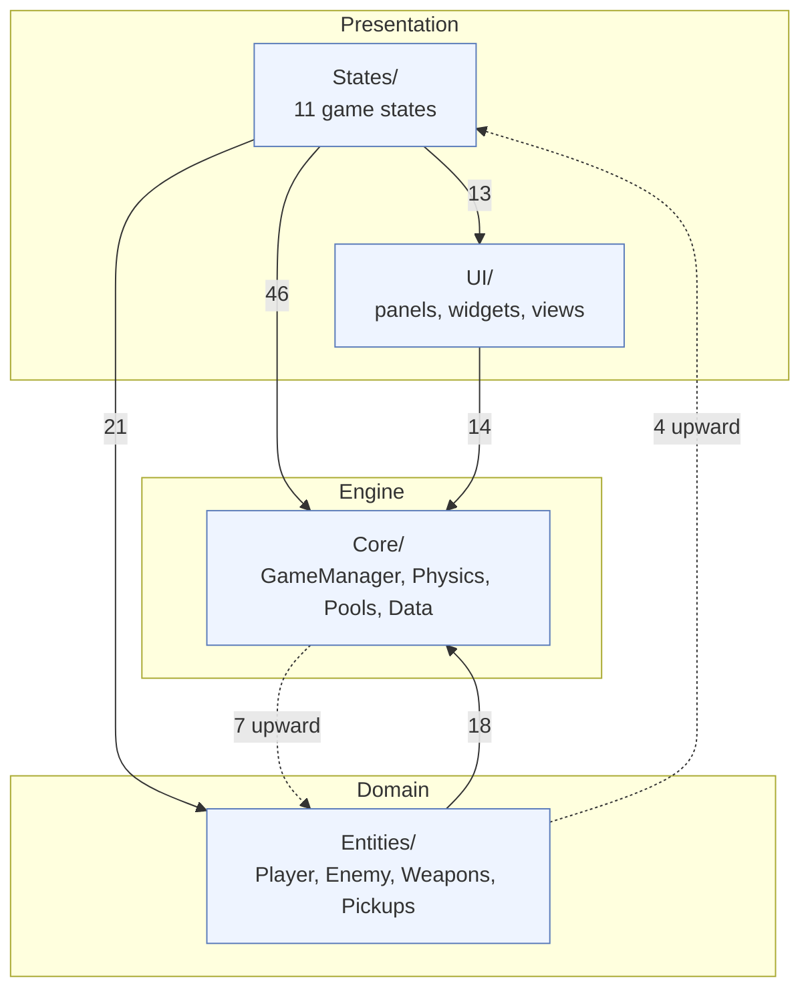
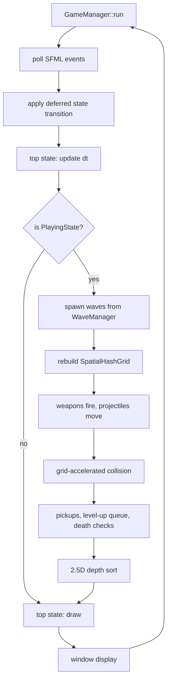
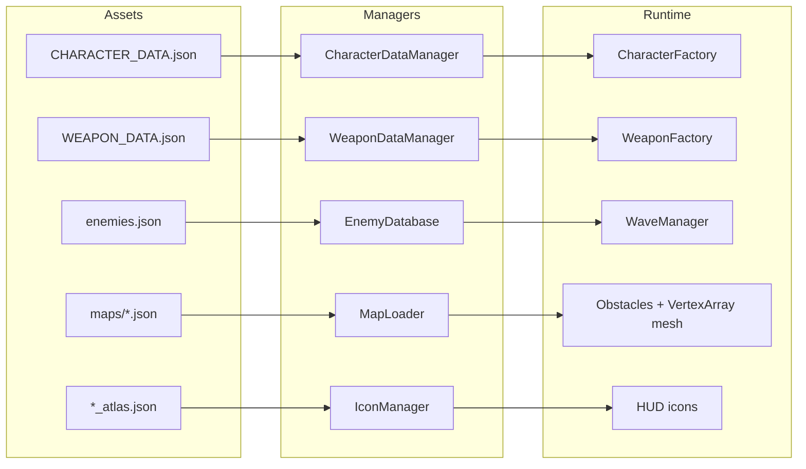
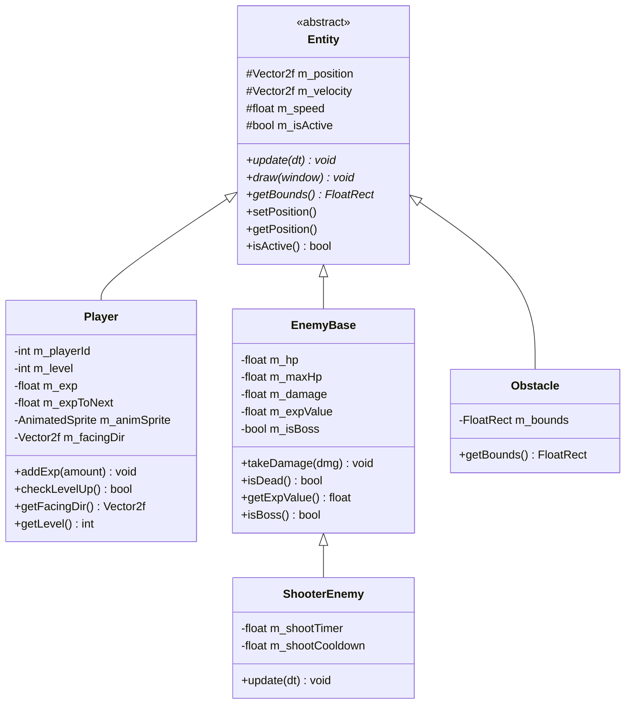
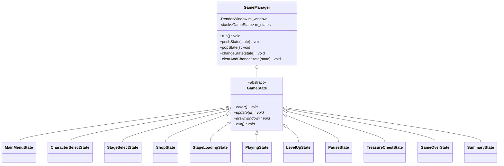
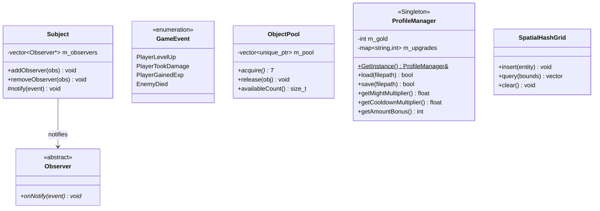
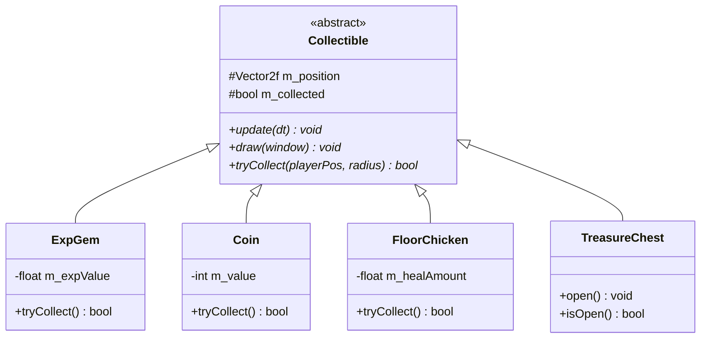

# Project Report

**Course:** CS202 - Object-Oriented Programming
**Project:** Vampire Survivors Clone (C++20 / SFML 2.6)
**Group:** 54
**Members:** Do Gia Huy (25125013), Vo Thanh Hai (25125011)
**Repository:** https://github.com/NewFace819/CS202-VampireSurvivors-Project

> One document of the Group 54 submission set -- see [`00_INDEX.md`](00_INDEX.md).

---

## 1. Project Overview

This is a faithful clone of the roguelite bullet-heaven game *Vampire Survivors*, built from scratch in C++20 with SFML. The player controls a character that auto-attacks enemies every frame, collects EXP, levels up, picks new weapons or upgrades, and tries to survive 30 minutes or defeat the stage boss.

---

---

## 2. High-Level Architecture

### 2.1 Package structure

The project is layered into four top-level source packages (159 source files total):

| Package | Files | Responsibility |
|---|---|---|
| `Core/` | 42 | Engine primitives: `GameManager` (FSM host), `ObjectPool`, `Observer`/`Subject`, `Physics`, `SpatialHashGrid`, `ResourceManager`, data managers |
| `Entities/` | 48 | Runtime objects: `Entity` -> `Player` / `EnemyBase` / `Obstacle`, plus `Projectile`, `Weapons` and `Pickups` |
| `States/` | 27 | FSM nodes: MainMenu, CharacterSelect, StageSelect, Shop, StageLoading, Playing, LevelUp, Pause, TreasureChest, GameOver, Summary |
| `UI/` | 42 | Reusable UI components, panels and views shared across states |

### 2.2 Layer dependencies

Edge labels are the number of `#include` relationships between packages, counted from
the source rather than idealised:

The dependency flow is predominantly downward: presentation depends on domain, domain
depends on engine. **Dotted edges are upward dependencies that break strict layering**,
and we record them rather than hide them:

- `Core/Physics` and `Core/Data` include concrete entity types (`EnemyBase`, `Obstacle`,
  `EnemyDatabase`) because collision, knockback and map loading operate on those types
  directly instead of on an abstract interface.
- `Entities/Pickups` (`Coin`, `ExpGem`, `FloorChicken`) include `PlayingState`, because a
  pickup calls back into the running game to grant gold, EXP or health.
- `Core/GameManager` includes `PlayingState` and `MainMenuState` to construct the initial
  state.

The cleanest fix would be to invert these through interfaces -- a `PickupReceiver` that
`PlayingState` implements would remove the `Entities -> States` edge entirely. We left it
as-is because the coupling is small and stable, but it is a genuine deviation from the
layering the diagram otherwise follows.

### 2.3 Frame flow

One iteration of the main loop. `GameManager` owns a stack of states and delegates to the
top of it; only `PlayingState` runs the full simulation:

### 2.4 Data-driven pipeline

Content is authored as JSON and loaded at run time, so adding a stage, character or
enemy needs no code change:

---

---

## 3. Class Diagrams

### 3.1 Entity Hierarchy

### 3.2 Weapon System

### 3.3 State Machine (Game Flow)

### 3.4 Core Systems

### 3.5 Data Layer

### 3.6 Pickup / Collectible System

---

---

## 4. Applied Design Patterns

### 4.1 Finite State Machine (FSM) — *Behavioral Pattern*

**Where:** `GameManager` + all `GameState` subclasses.

`GameManager` owns a `std::stack<unique_ptr<GameState>>`. States are swapped via deferred transitions (`m_pendingState`, `m_shouldChange` flags) evaluated at the start of each frame loop — preventing a state from deleting itself mid-`update()` and causing use-after-free.

**Reasoning:** The game has 11 distinct modes. Hardcoding transitions in a monolithic loop would be unmaintainable. The stack model lets modal overlays (Pause, LevelUp) sit on top of PlayingState without destroying it.

---

### 4.2 Template Method — *Behavioral Pattern*

**Where:** `WeaponBase::update()` (non-virtual) calls `fire()` (pure virtual).

`WeaponBase::update()` owns the cooldown timer and burst-fire scheduling logic, then calls the abstract `fire()` at the right moments. Each concrete weapon only overrides `fire()`.

**Reasoning:** All 16+ weapons share identical cooldown, burst-interval, and `setSourceWeapon` bookkeeping. Without Template Method this would be copy-pasted in every weapon class. Any future timing tweak is fixed in one place.

---

### 4.3 Factory Method — *Creational Pattern*

**Where:**
- `WeaponFactory::createWeapon(const std::string& name)`: Instantiates concrete weapons from string identifiers.
- `CharacterFactory::configurePlayer(Player& player, CharacterType type, std::vector<std::string>& outStartingWeapons)`: Encapsulates sprite setup, animation frame slicing from atlas JSONs, and starting weapon assignment for all 40+ characters.

**Reasoning:**
- Decouples the 16+ concrete weapon types and 40+ playable character variants from game states.
- Avoids monolithic `switch` blocks in `PlayingState` and isolates sprite asset paths, atlas parsing, and initial weapon distributions into clean, dedicated factory classes.

---

### 4.4 Observer / Subject — *Behavioral Pattern*

**Where:** `Core/Observer.h` — `Observer` (abstract), `Subject` (mixin), `GameEvent` enum.

Game objects that produce notable events inherit `Subject` and call `notify(GameEvent)`. Interested systems register as `Observer*` and react in `onNotify()`.

**Reasoning:** Eliminates tight coupling between, e.g., an enemy dying and the UI gold counter updating. The enemy doesn't need a pointer to UIManager.

---

### 4.5 Object Pool — *Creational / Performance Pattern*

**Where:** `ObjectPool<T>` template; used as `ObjectPool<EnemyBase>` and `ObjectPool<ShooterEnemy>` in `PlayingState`.

Pre-allocates 10 000 enemy objects and 2 000 shooter objects at startup; `acquire()` pops from the free list in O(1), `release()` pushes back. Raising the capacity was a one-line constructor change precisely because allocation is encapsulated behind the pool.

**Reasoning:** A Vampire Survivors clone spawns hundreds of enemies per minute. Repeated `new`/`delete` causes heap fragmentation and latency spikes. The pool eliminates this entirely.

---

### 4.6 Singleton — *Creational Pattern*

**Where:** `ProfileManager::GetInstance()`.

Holds persistent save data (gold, powerup ranks) and per-run stat multipliers. Accessed by `WeaponBase::update()`, `PlayingState`, `LevelUpState`, `ShopState`, and `SummaryState`.

**Reasoning:** Save data is truly global and must survive state transitions. A single instance avoids duplication and is the standard approach for game save managers.

---

### 4.7 Strategy via Polymorphism — *Behavioral Pattern*

**Where:** Each `WeaponBase` subclass is a pluggable fire strategy.

`PlayingState` stores `vector<unique_ptr<WeaponBase>>` and calls `w->update()` uniformly. The concrete weapon decides *how* to fire (melee sweep, homing projectile, area zone, orbiting bible, etc.).

---

### 4.8 Spatial Hash Grid — *Performance Pattern*

**Where:** `Core/Physics/SpatialHashGrid`.

Divides the infinite world into fixed-size cells. Collision queries return only entities in the same or neighbouring cells — O(1) average lookup instead of O(n²) brute force.

**Reasoning:** With thousands of enemies and 100+ projectiles simultaneously, a naive nested loop is prohibitive: at 3 000 enemies against 200 projectiles it is ~600 000 intersection tests per frame. The grid reduces each query to the entities in the neighbouring cells only.

Queries take a radius rather than a fixed 3x3 cell scan, so large-area weapons (Garlic's aura, Santa Water's zones) cannot miss enemies sitting at their edges, and enemy separation asks for the pair's combined radius so it stays correct if the cell size is retuned.

---

---

## 5. Design Reasoning

### Why SFML?
SFML is a thin, idiomatic C++ wrapper over OpenGL/DirectSound. It has no engine overhead, forces every system to be hand-written, and fits the OOP teaching objectives of CS202 without hiding concepts behind engine magic.

### Why stack-based FSM with deferred transitions?
A simple `switch` breaks when a state must both push a new state AND keep the old one alive (e.g., Pause over Playing). Deferred transitions prevent the "iterator invalidation" class of bugs where a state deletes itself mid-update.

### Why Template Method for weapons instead of composition?
Every weapon shares ~40 lines of burst-fire timing code. Since the only variable behaviour is `fire()`, Template Method is simpler and faster than injecting a separate strategy object, and aligns with how the original game was architected.

### Why a bounded Object Pool?
Dynamic allocation mid-frame is non-deterministic in time. A bounded pool of 1 000 slots guarantees O(1) allocation and avoids heap fragmentation. The bound also implicitly caps worst-case entity count.

### Why data-driven managers?
Hard-coding 40+ character stats and 30-minute wave sequences in C++ makes balancing a recompile cycle. File-driven managers let data be tweaked without touching source code.

---
